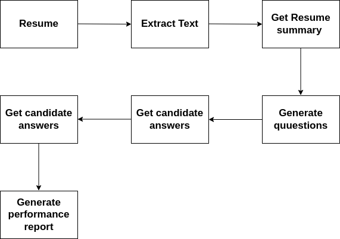
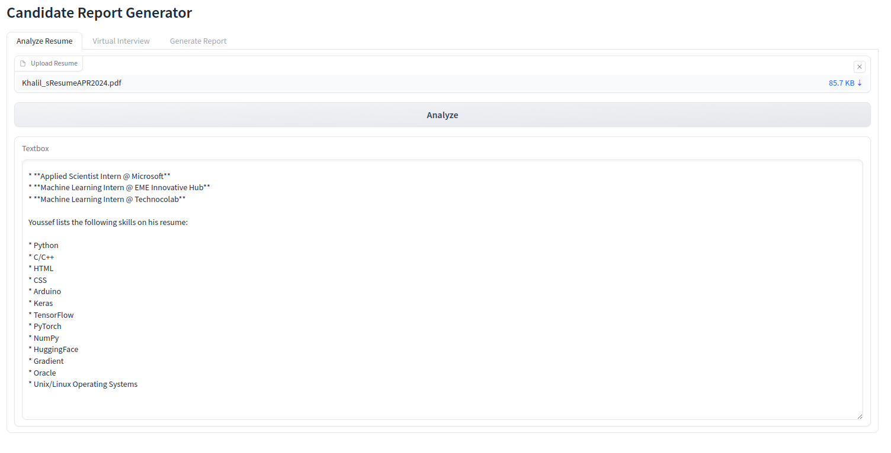
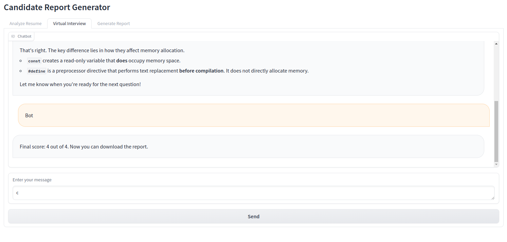
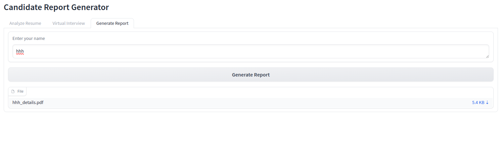
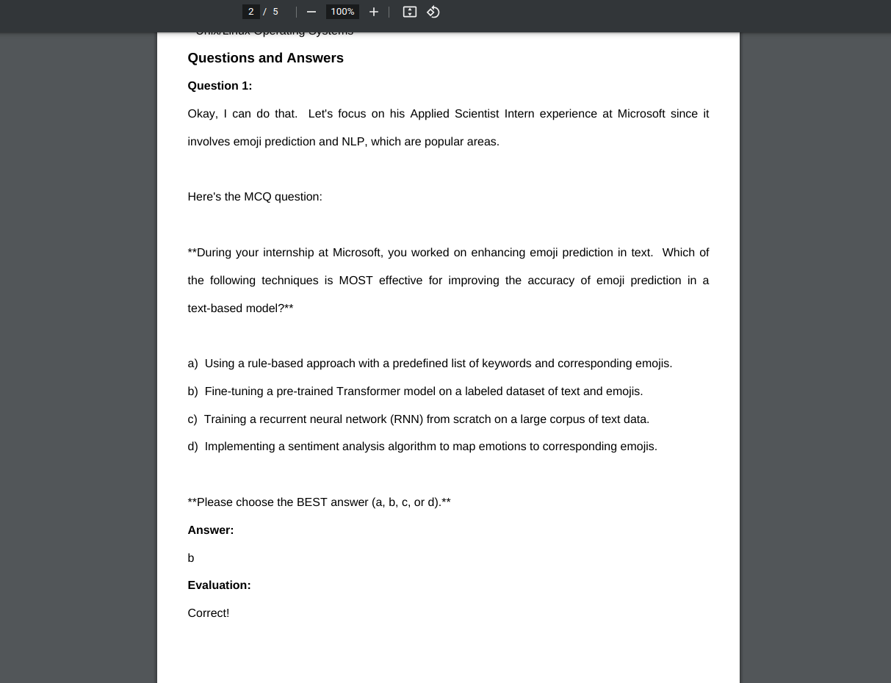

# Job Application Analyzer

## Description

The Job Application Analyzer is a sophisticated tool designed to streamline the process of analyzing and evaluating job applications. Leveraging advanced natural language processing (NLP) and artificial intelligence (AI) models, this tool automates the extraction of key details from resumes, conducts virtual interviews with candidates, and generates comprehensive reports. The primary goal is to assist HR professionals and recruiters in efficiently assessing candidate qualifications and fit for a given role.

### System Design



## Features

- **Resume Analysis**: Automatically extract and summarize key details such as years of experience, education, job titles, and skills from uploaded resumes.
- **Virtual Interview**: Conduct virtual interviews with candidates by asking predefined questions related to job roles and skills, and evaluate their responses.
- **Report Generation**: Generate detailed PDF reports summarizing the resume analysis and interview performance, customized with the candidate's name.

## Usage

### Step 1: Create a Virtual Python Environment

First, create a new virtual environment to ensure all dependencies are isolated from your main Python installation.

```bash
conda create -n job_application python=3.9
```

### Step 2: Activate the Environment

```bash
conda activate job_application
```

### Step 3: Install the Requirements

```bash
pip install -r requirements.txt
```

### Step 4: Install NLTK Stop Words

```bash
cd nltk_scripts
python stop_words_downloader.py
cd ..
```

### Step 5: Obtain Gemini-1.5-Pro API Key

To use this application, you need to obtain an API key for Gemini-1.5-Pro from [Google AI Studio](https://aistudio.google.com/app/). Once obtained, follow these steps:

1. Rename `.env.example` to `.env`.
2. Paste your API key as the value for `GEMINI_API_KEY` in the `.env` file.

### Optional: Using Ollama Models

If you wish to experiment with Ollama models, follow these additional steps:

#### Download Ollama Docker Image
Pull the Ollama Docker image and run it in a detached state, with a volume mounted to persist data and a port exposed for communication.

```bash
docker run -d -v ollama:/root/.ollama -p 11435:11434 --name ollama ollama/ollama
```

#### Run Llama3 Model Locally
Execute the Llama3 model within the running Docker container.

```bash
docker exec -it ollama ollama run llama3
```

### Step 6: Run the gradio app

```bash
python app.py
```
Paste the following url in the browser 

```bash
http://127.0.0.1:7860
```

## Demo






## Contribution
Contributions are welcome! If you find any issues or have suggestions for improvement, please create an issue or submit a pull request on the project's GitHub repository.

### Future work 

- Working for better prompts 
- testing another LLMs and comparing performance and latency time
- building better front-end using different framework
- adding video interview analysis feature 
- adding job description-Resume matching feature
- supporting multiple languages 